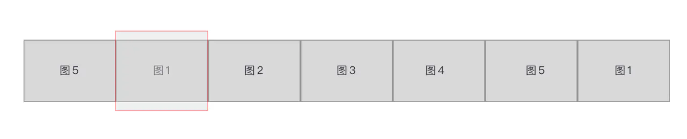
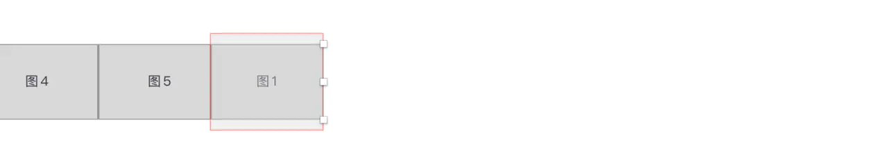
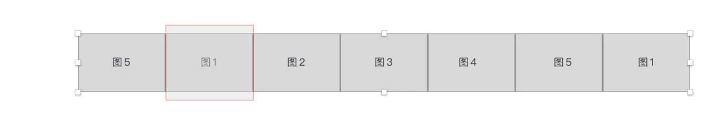

# 基于Vue.js实现无限轮播组件

> - 参考
>   - [面向Vue新人：使用Vue写一个图片轮播组件](https://juejin.im/post/6844903577761103880)
>   - 找图片：[1.8 million+ Stunning Free Images to Use Anywhere - Pixabay](https://pixabay.com/)

> - 目录

[toc]

## 一、需求和原理
### 1. 需求
- **轮播**：在点击右侧箭头，图片向左滑动到下一张；点击左侧箭头时，图片向右滑到下一张；
- **无限轮播（重点）**：即在滚动到最后一张时，再点击下一张时会继续向左滑动到第一张，而不是整个拉到第一张；相反方向也一样；
- **导航**：点击下面的小圆点，滑到对应的图片，相应小圆点的样式也发生改变；
- **过渡（难点）**：要有过渡效果 / 缓缓滑动过去；
- **自动轮播与暂停**：当鼠标hover到图片上时，轮播暂停，避免与导航操作冲突；鼠标leave时，轮播继续。

### 2. 轮播的原理
- 首先将所有图片（包括首尾占位的两张）水平并排起来，封装进一个`ul.container`中；
- 然后使用CSS3的`transform: translate3d(${distance}px, 0px, 0px)`进行X轴方向的平移；等效于`transform: translateX(${distance}px)`，好处是前者可以使用3d硬件加速。

### 3. 无限轮播的原理
图片布局如下：



图中红框区域即是看到的图片区域，称为`window`。这个轮播组件只展示5张图片，但在首尾各还有两张图片，在图1前面放置了图5，在图5后面放置了图1。所以总共有7张图片。

**无限轮播的原理在于：当整个图向左滚动到右边的图5时，此时点击向右，会继续向左滚动到末尾的图1；在完全显示出图1后，以肉眼看不见的速度「瞬间」向右侧「拉回」到左边的图1。**这样，继续点击向右，看到的就是图2了。

如下图所示，在最后的图1完成过渡完全显示出来后，再将整个列表瞬间向右拉到左侧的图1。





### 4. 过渡的原理
可选项：CSS3的`transition`与`setTimeout`方法

## 二、布局与样式
### 1. 布局
其中`<div class="window">`即[原理](#3. 无限轮播的原理)中的红框区域

```html
<div id="slider">
  <div class="window" ref="sliderWindow">
    <!-- 轮播图视窗 -->
    <ul class="container" :style="containerStyle">
      <!-- 图片容器 -->
      <li class="placeholder">
        <!-- 最前面的占位图 -->
        
      </li>
      <li v-for="(item, index) in sliders" :key="index">
        
      </li>
      <li class="placeholder">
        <!-- 最后面的占位图 -->
        
      </li>
    </ul>
    <!-- 导航箭头 -->
    <ul class="direction">
      <li class="left-arrow">
        <!-- <svg>太长省略</svg> -->
      </li>
      <li class="right-arrow">
        <!-- <svg>太长省略</svg> -->
      </li>
    </ul>
    <!-- 导航圆点 -->
    <ul class="dots">
      <li v-for="(dot, i) in sliders" :key="i"
        :class="{ dotted: i === currentIndex }"
      ></li>
    </ul>
  </div>
</div>
```

### 2. 样式
- 主要是`window`中图片的水平并排，以及导航箭头和导航圆点的绝对定位（`position: absolute`）
- 本例将`window`的**宽度**固定为**600px**，高度300px；要使`window`中图片的水平并排，首先要将`ul.container`的**宽度**放大到**`${图片数+2}`**倍，然后设置各`li`的`float: left`，这里使用`display: inline-block`的话会有一些边框（去除方法见[`display:inline-block`元素之间空隙的产生原因和解决办法](https://blog.csdn.net/qq_32614411/article/details/82223624)）。本例使用`float: left`去除。

```css
html, body {
  width: 100%;
  height: 100%;
  margin: 0;
  padding: 0;
}

body {
  display: flex;
  justify-content: center;
  align-items: center;
  background: #ccc;
}

#slider {
  width: 600px;
  height: 300px;
  padding: 20px;
  border-radius: 5px;
  background: #eee;
  box-shadow: 0px 0px 20px rgba(0, 0, 0, 0.2);
}

#slider .window {
  height: 100%;
  position: relative;
  overflow: hidden;
}

#slider ul {
  margin: 0;
  padding: 0;
}

#slider li {
  margin: 0;
  padding: 0;
  list-style: none;
}

/* container */
#slider .container {
  /* width: 700%; */
  height: 100%;
  /* transition: transform .3s; */
}
#slider .container li {
  width: 600px;
  height: 100%;
  float: left;
  margin: 0;
  padding: 0;
}
#slider .container li img {
  width: 100%;
  height: 100%;
}

/* direction */
#slider .direction li {
  width: 48px;
  height: 48px;
  display: flex;
  justify-content: center;
  align-items: center;
  border-radius: 50%;
  background-color: rgba(0, 0, 0, 0.6);
  opacity: 0.5;
  cursor: pointer;
  transition: opacity .3s;
}
#slider .direction li:hover {
  opacity: 0.8;
}
#slider .direction .left-arrow {
  position: absolute;
  left: 10px;
  top: 126px;
}
#slider .direction .left-arrow svg {
  position: relative;
  left: 5px;
}
#slider .direction .right-arrow {
  position: absolute;
  right: 10px;
  top: 126px;
}
#slider .direction .right-arrow svg {
  position: relative;
  right: 5px;
}

/* dots */
#slider .dots {
  text-align: center;
  position: relative;
  bottom: 23px;
}

#slider .dots li {
  width: 10px;
  height: 10px;
  border: 2px solid #eeefff;
  border-radius: 50%;
  margin: 0 6px;
  background-color: #444;
  display: inline-block;
  cursor: pointer;
}

#slider .dots li.dotted {
  background-color: #49c0ec;
}
```

## 三、让图片能够切换
### 1. Vue实例的基本配置
```js
var sliderApp = new Vue({
  el: '#slider',
  data () {
    return {
      sliders: [
        { src: 'img/img-1.jpg' },
        { src: 'img/img-2.jpg' },
        { src: 'img/img-3.jpg' },
        { src: 'img/img-4.jpg' },
        { src: 'img/img-5.jpg' },
      ],
      currentIndex: 0,  // 当前显示的图片索引（0-sliders.length-1）
      distance: -600,   // 当前container的X轴偏移量（offset）
    };
  },
  computed: {
    containerStyle () {
      // 这里使用计算属性，用transform+translate3d来移动整个图片列表
      return {
        transform: `translate3d(${this.distance}px, 0, 0)`,
        width: `${this.sliders.length + 2}00%`,
      }
    },
  },
  methods: {},
  mounted: {},
  destroyed: {},
});
```

### 2. 通过箭头导航
- 根据[原理](#2. 轮播的原理)，通过修改`distance`可以实现图片的切换；
- 当点击**左侧**的箭头，`ul.container`**向右平移**，`distance`的数值变大；当点击**右侧**的箭头，`ul.container`**向左平移**，`distance`的数值变小；
- 通过在导航箭头上添加点击事件，实现导航

```html
  <!-- 导航箭头 -->
  <ul class="direction">
    <li class="left-arrow" @click="move(600, 1)">
      <!-- <svg>太长省略</svg> -->
    </li>
    <li class="right-arrow" @click="move(600, 1)">
      <!-- <svg>太长省略</svg> -->
    </li>
  </ul>
  <!-- ... -->

<script>
// ...

  methods: {
    move (offset, direction) {
      this.distance += offset * direction;
      // -1 * 600 * this.sliders.length
      if (this.distance < -3000) this.distance = -600;
      // -1 * 600
      if (this.distance > -600) this.distance = -3000;
    },
  }

// ...
</script>

```

通过如上修改，点击左侧或右侧导航箭头，将调用`move`方法，接收偏移量`offset`和方向`direction`两个参数。

- `direction`只传两个值，`1`表示按下左侧导航箭头，`ul.container`向右平移（`distance`增大），`-1`表示按下右侧导航箭头，`ul.container`向左平移（`distance`减小）；
- `offset`为`600`，也就是一张图片的宽度；
- 最后，**如果移动到7张图片的末尾占位图图1（`this.distance === -3600`），则将`ul.container`拉回7张图片的第2张图图1；如果移动到7张图片的头部占位图图5（`this.distance === 0`），则将`ul.container`拉回7张图片的第6张图图5；**
从而实现无限轮播。

### 3. 使小圆点跟随图片位置变化
根据html模板中的`:class="{ dotted: i === currentIndex }"`，通过修改小圆点的`i`与`currentIndex`对应关系，就能使小圆点的状态随图片当前位置变化。

```js
// ...

  methods: {
    move (offset, direction) {
      this.distance += offset * direction;
      if (this.distance < -3000) this.distance = -600;
      if (this.distance > -600) this.distance = -3000;
      
      // dot
      direction === -1 ?
        this.currentIndex++:
        this.currentIndex--;
      // if (this.currentIndex >= this.sliders.length) this.currentIndex = 0;
      // if (this.currentIndex < 0) this.currentIndex = this.sliders.length - 1;
      // 上面两行等效于
      const len = this.sliders.length;
      this.currentIndex = (this.currentIndex + len) % len;
    },
  }

// ...
```

### 4. 通过小圆点导航
- 给小圆点的`click`事件绑定`jump`方法实现点击小圆点切换

```html
  <!-- 导航圆点 -->
  <ul class="dots">
    <li v-for="(dot, i) in sliders" :key="i" 
    :class="{ dotted: i === currentIndex }"
    @click = jump(i)>
    </li>
  </ul>
  <!-- ... -->
  
<script>
// ...

  methods: {
    move (offset, direction) { /* ... */ },
    jump (index) {
      if (index === this.currentIndex) return;
      // 获取滑动方向
      const direction = index - this.currentIndex >= 0 ? -1 : 1;
      // 获取滑动距离
      const offset = Math.abs(index - this.currentIndex) * 600;
      // 调用move
      this.move(offset, direction);
    }
  }

// ...
</script>

```

上面代码有一个问题，在`jummp`方法中调用`move`方法，`move`例对于`currentIndex`都是`±1`，而点击小圆点的步程可以大于1，所以要对`move`里的代码修改如下

```js
direction === -1 ?
  this.currentIndex += offset/600:
  this.currentIndex -= offset/600;
```

## 四、过渡效果

到目前已经可以通过点击箭头和小圆点实现轮播和无限轮播，但是切换时没有动画效果，显得十分生硬。

掘金原作者使用的是[`setTimeout`加递归](https://juejin.im/post/6844903577761103880#heading-6)的方法实现，具体可以通过将`index.html`第53行引入改为`main.js`进行体验（需要将`index.html`第16行修改为`animate: false`关闭css效果），但过渡效果略有些生硬。

于是尝试使用CSS的`transition`属性实现过渡动画。

### 1. 直接添加`transition`
修改`css/style.css`，给`#slider .container`添加`transition`属性

```css
/* container */
#slider .container {
  /* width: 700%; */
  height: 100%;
  transition: transform .3s;
}
```

进行测试后发现，当在图1-图5之间左右切换时，过渡效果良好，没有了`setTimeout`方法的生硬感，但是在**图1→图5**和**图5→图1**的切换过程中会出现闪动，原因是`move`中的将`ul.container`**「拉回」**的操作也触发了`transition`，不再是**「瞬间」**完成的。

### 2. 添加一个动画开关

**在几番试验后，得出这样一个方法：**

- 用一个`animateTrigger`作为`ul.container`的`transition`动画效果开关（通过`class`钩子实现）；
- 在`move`做**「拉回」**操作前，将动画效果关闭；**「拉回」**操作完成后，再将动画效果打开；
- 由于需要先切换到占位的图片（例如第2张的图1先平移到第1张的占位图图5），这个过程仍需要过渡效果（假定300毫秒），所以需要**延迟进行「拉回」**，通过`setTimeout`实现；恢复动画效果的操作可以比300毫秒再久一点，如500毫秒，也是通过`setTimeout`实现。

综上，代码修改如下

```html
<!-- 轮播图视窗 -->
<ul :class="{
    container: true,
    animate: animateTrigger
  }" :style="containerStyle">
  <!-- /* ... */ -->
</ul>

<!-- ... -->

<style>
/* ... 添加 animate 类 */
#slider .container.animate {
  transition: transform .3s;
}
/* ... */
</style>

<!-- ... -->

<script>
// ...

  data () {
    return {
      sliders: [ /* ... */ ],
      currentIndex: 0,
      distance: -600,
      // 动画开关
      animateTrigger: true,
    };
  },
  // ...
  methods: {
    move (offset, direction) {
      this.distance += offset * direction;
      setTimeout(() => {
        this.animateTrigger = true;
      }, 500);
      // 所谓“瞬间”拉回，实现无限滚动
      if (this.distance < -3000) {
        setTimeout(() => {
          this.animateTrigger = false;
          this.distance = -600;
        }, 300);
      }
      if (this.distance > -600) {
        setTimeout(() => {
          this.animateTrigger = false;
          this.distance = -3000;
        }, 300);
      }
      
      // dot
      direction === -1 ?
        this.currentIndex += offset/600:
        this.currentIndex -= offset/600;
      // if (this.currentIndex >= this.sliders.length) this.currentIndex = 0;
      // if (this.currentIndex < 0) this.currentIndex = this.sliders.length - 1;

      // 上面两行等效于
      const len = this.sliders.length;
      this.currentIndex = (this.currentIndex + len) % len;
    },
    jump (index) { /* ... */ },
  },

// ...
</script>
```

进行测试，已经可以实现无限轮播的平滑过渡。

使用`transition`的好处还在于通过点击小圆点导航时，不必像原作者的方法那样考虑滑动速度过慢，因为它仍然在`transition`设置的`duration`时间内平滑地过渡。

### 3. 节流

上述方法有个小缺陷，就是如果频繁点击导航箭头或导航圆点也可能导致闪动，其原因是`setTimeout`存在的延时，因此可以通过使用一个`transitionEnd`阀变量进行对`move`节流(throttle)。

```js
// ...

  data () {
    return {
      sliders: [ /* ... */ ],
      currentIndex: 0,
      distance: -600,
      // move节流
      transitionEnd: true,
      // 动画开关
      animateTrigger: true,
      // 
    };
  },
  // ...
  methods: {
    move (offset, direction) {
      if (!this.transitionEnd) return;
      this.transitionEnd = false;
      
      this.distance += offset * direction;
      setTimeout(() => {
        this.animateTrigger = true;
        this.transitionEnd = true;  // 释放节流阀
      });
      // 所谓“瞬间”拉回，实现无限滚动
      if (this.distance < -3000) {
        setTimeout(() => {
          this.animateTrigger = false;
          this.distance = -600;
        }, 300);
      }
      if (this.distance > -600) {
        setTimeout(() => {
          this.animateTrigger = false;
          this.distance = -3000;
        }, 300);
      }
      
      // dot
      direction === -1 ?
        this.currentIndex += offset/600:
        this.currentIndex -= offset/600;
      // if (this.currentIndex >= this.sliders.length) this.currentIndex = 0;
      // if (this.currentIndex < 0) this.currentIndex = this.sliders.length - 1;

      // 上面两行等效于
      const len = this.sliders.length;
      this.currentIndex = (this.currentIndex + len) % len;
    },
    jump (index) { /* ... */ },
  },

// ...
```

至此，**轮播**、**无限轮播**、**导航**、**过渡**四个功能点已经完成。接下来可以着手实现**自动轮播**功能。

## 五、自动轮播与暂停

最后实现**自动轮播与暂停**功能。这个通过`setInterval`就可以实现，主要关注点在于为了避免自动轮播与用户点击导航箭头/导航圆点的操作发生冲突，应设计为用户鼠标hover到轮播图组件时，轮播暂停，用户鼠标leave轮播图组件时，轮播继续。

这里直接上代码，主要是添加`mounted`钩子和绑定鼠标事件。

```js
// ...
data () {
  return {
    sliders: [ /* ... */ ],
    currentIndex: 0,
    distance: -600,
    // move节流
    transitionEnd: true,
    // 动画开关
    animateTrigger: true,
    // 自动轮播与停止
    autoplayTimer: null,
  };
},
computed: {
  containerStyle () { /* ... */ },
  interval () {
    return 5 * 1000;
  }
},
methods: {
  init () {
    this.play();
    // 移入时停止轮播，移出时开始轮播
    this.$refs.sliderWindow.addEventListener('mouseleave', function () {
      this.play();
    }.bind(this));
    this.$refs.sliderWindow.addEventListener('mouseenter', function () {
      this.stop();
    }.bind(this));
  },
  move (offset, direction) { /* ... */ },
  jump (index) { /* ... */ },
  // 自动轮播与停止
  play () {
    console.log('play');
    if (this.autoplayTimer) {
      window.clearInterval(this.autoplayTimer);
      this.autoplayTimer = null;
    }
    this.autoplayTimer = window.setInterval(() => {
      this.move(600, -1);
    }, this.interval);
  },
  stop () {
    console.log('stop');
    if (this.autoplayTimer) {
      window.clearInterval(this.autoplayTimer);
      this.autoplayTimer = null;
    }
  }
},
mounted () {
  this.init();
},
destroyed () {
  this.stop();
},
// ...
```

## 六、后记

本例在原作者[limingru](https://juejin.im/user/272334612599629)的工作基础上实现了一个基于Vue的无限轮播图组件，略为粗糙，还有许多地方可以优化，比如可以像原作者一样将`Interval`写为对外接口，此外`move`方法中`distance`的计算与`window`的`width`也存在较强的耦合性，可以将`Width`也作为对外接口。

后续还可以添加垂直方向等功能，也有很多成熟的轮播图轮子如[**Swiper.js**](https://swiperjs.com)可供参考。

**源码**：[GitHub](https://github.com/ScutLion45/Web-Learning/tree/master/202010/201007-Carousel)