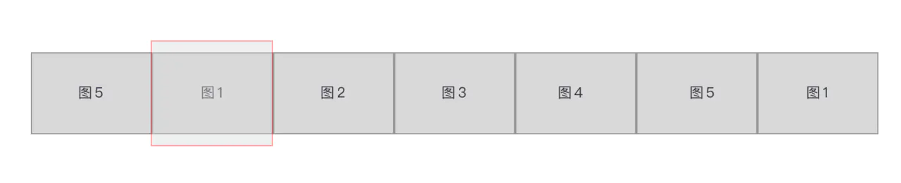
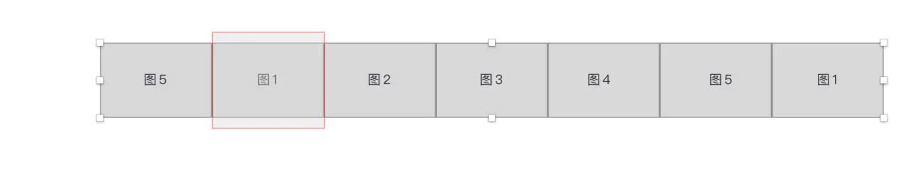

# 基于Vue.js实现无限轮播组件

> - 参考
>   - [面向Vue新人：使用Vue写一个图片轮播组件](https://juejin.im/post/6844903577761103880)
>   - 找图片：[1.8 million+ Stunning Free Images to Use Anywhere - Pixabay](https://pixabay.com/)

## 一、需求和原理
### 1. 需求
- **轮播**：在点击右侧箭头，图片向左滑动到下一张；点击左侧箭头时，图片向右滑到下一张；
- **无限轮播（重点）**：即在滚动到最后一张时，再点击下一张时会继续向左滑动到第一张，而不是整个拉到第一张；相反方向也一样；
- **导航**：点击下面的小圆点，滑到对应的图片，相应小圆点的样式也发生改变；
- **过渡（难点）**：要有过渡效果 / 缓缓滑动过去；
- **自动轮播与暂停**：当鼠标hover到图片上时，轮播暂停；鼠标leave时，轮播继续。

### 2. 无限轮播的原理
图片布局如下：

图中红框区域即是看到的图片区域，称为`window`。这个轮播组件只展示5张图片，但在首尾各还有两张图片，在图1前面放置了图5，在图5后面放置了图1。所以总共有7张图片。

**无限轮播的原理在于：当整个图向左滚动到右边的图5时，此时点击向右，会继续向左滚动到末尾的图1；在完全显示出图1后，以肉眼看不见的速度「瞬间」向右侧「拉回」到左边的图1。**这样，继续点击向右，看到的就是图2了。

如下图所示，在最后的图1完成过渡完全显示出来后，再将整个列表瞬间向右拉到左侧的图1。

