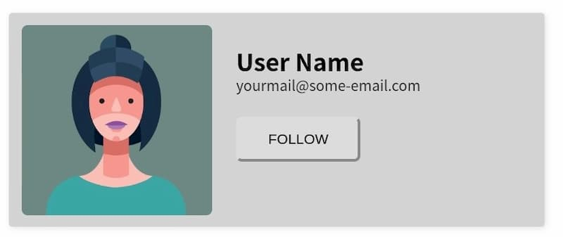

# Web Components API 学习

> Ref:
> - [Web Components 入门实例教程 - 阮一峰的网络日志](web_components.html)
> - [Web Components - MDN](https://developer.mozilla.org/zh-CN/docs/Web/Web_Components)
>   - [使用 templates and slots - MDN](https://developer.mozilla.org/zh-CN/docs/Web/Web_Components/Using_templates_and_slots)
> - [Web Component 快速入门 - 叛变的小师弟](https://zhuanlan.zhihu.com/p/80763899)
> - [CSS 选择器参考手册 - W3school](https://www.w3school.com.cn/cssref/css_selectors.asp)

[toc]

## 一、简介

**Web Component** 是一种 **W3C 标准**支持的**组件化方案**，通过它，我们可以编写可复用的**组件**，同时，我们也可以对自己的组件做更精细化的控制。正如 PWA 一样，**他并非一项单一的技术，而是由三项技术组成**： 

- **Custom elements（自定义元素）**：一组JavaScript API，允许开发者定义 custom elements 及其行为，然后可以在用户界面中按照需要使用它们。
- **Shadow DOM（影子DOM）**：一组JavaScript API，用于将封装的“影子” DOM 树附加到元素（与主文档DOM分开呈现）并控制其关联的功能。通过这种方式，开发者可以保持元素的功能私有，这样它们就可以被脚本化和样式化，而不用担心与文档的其他部分发生冲突。
- **HTML templates（HTML模板）**：[`template`](https://developer.mozilla.org/zh-CN/docs/Web/HTML/Element/template) 和 [`slot`](https://developer.mozilla.org/zh-CN/docs/Web/HTML/Element/slot) 元素使您可以编写不在呈现页面中显示的标记模板。然后它们可以作为自定义元素结构的基础被多次重用。

#### 实现 Web Component 的典型步骤

1. 创建一个类或函数来指定  Web Component 的功能；
2. 使用  [`CustomElementRegistry.define()`](https://developer.mozilla.org/zh-CN/docs/Web/API/CustomElementRegistry/define)  方法注册新自定义的元素 ，并向其传递要定义的元素名称、指定元素功能的类、以及可选的其所继承自的元素。
3. 如果需要的话，使用 [`Element.attachShadow()`](https://developer.mozilla.org/zh-CN/docs/Web/API/Element/attachShadow)  方法将一个 shadow DOM 附加到自定义元素上。使用通常的 DOM 方法向 shadow DOM 中添加子元素、事件监听器等等。
4. 如果需要的话，使用 [`template`](https://developer.mozilla.org/zh-CN/docs/Web/HTML/Element/template) 和 [`slot`](https://developer.mozilla.org/zh-CN/docs/Web/HTML/Element/slot) 定义一个 HTML 模板。再次使用常规 DOM 方法克隆模板并将其附加到 shadow DOM 中。
5. 在页面任何位置使用自定义元素，就像使用常规 HTML 元素那样。

## 二、自定义元素

下图是用户卡片，下面演示如何将这个卡片写成  Web Component 组件。

<center></center>

网页只要插入下面的代码，就会显示用户卡片。

```markup
<user-card></user-card>
```

这种自定义的 HTML 标签，称为自定义元素（custom element）。根据规范，**自定义元素的名称必须包含连词线**，用与区别原生的 HTML 元素。所以，`<user-card>`不能写成`<usercard>`。

## 三、customElements.define()

自定义元素需要使用 JavaScript 定义一个类，所有`<user-card>`都会是这个类的实例。

```javascript
class UserCard extends HTMLElement {
  constructor() {
    super();
  }
}
```

上面代码中，`UserCard`就是自定义元素的类。注意，这个类的父类是`HTMLElement`，因此继承了 HTML 元素的特性。

接着，使用浏览器原生的`customElements.define()`方法，告诉浏览器`<user-card>`元素与这个类关联。

```javascript
window.customElements.define('user-card', UserCard);
```

## 四、使用`<template>`定义 DOM

Web Components API 提供了`<template>`标签，可以在它里面使用 HTML 定义 DOM。

```html
<template id="userCardTemplate">
  
  <div class="container">
    <p class="name">User Name</p>
    <p class="email">user@example.com</p>
    <button class="follow">Follow</button>
  </div>
</template>
```

然后，改写一下自定义元素的类，为自定义元素加载`<template>`。

```javascript
class UserCard extends HTMLElement {
  constructor() {
    super();

    const templateElem = document.getElementById('userCardTemplate');
    const content = templateElem.content.cloneNode(true);
    this.appendChild(content);
  }
}
```

上面代码中，获取`<template>`节点以后，**克隆了它的所有子元素**，这是因为可能有多个自定义元素的实例，这个模板还要留给其他实例使用，所以不能直接移动它的子元素。

到这一步为止，完整的代码如下。

```html
<body>
  <user-card></user-card>
  <template>...</template>

  <script>
    class UserCard extends HTMLElement {
      constructor() {
        super();

        const templateElem = document.getElementById('userCardTemplate');
        const content = templateElem.content.cloneNode(true);
        this.appendChild(content);
      }
    }
    // 注册自定义组件
    window.customElements.define('user-card', UserCard);    
  </script>
</body>
```

## 五、自定义元素的参数

`<user-card>`内容现在是在`<template>`里面设定的，为了方便使用，把它改成参数。

```html
<user-card
  avatar="img/avatar.png"
  name="User Name"
  email="user@example.com"
></user-card>
```
`<template>`代码也相应改造。

```html
<template id="userCardTemplate">
  
  <div class="container">
    <p class="name"></p>
    <p class="email"></p>
    <button class="follow"></button>
  </div>
</template>
```

最后，改一下类的代码，把参数加到自定义元素里面。

```javascript
class UserCard extends HTMLElement {
  constructor() {
    super();

    const templateElem = document.getElementById('userCardTemplate');
    const content = templateElem.content.cloneNode(true);
    content.querySelector('.avatar').setAttribute('src', this.getAttribute('avatar'));
    content.querySelector('.name').textContent = this.getAttribute('name');
    content.querySelector('.email').textContent = this.getAttribute('email');
    this.appendChild(content);
  }
}
```

## 六、Shadow DOM

> Web components 的一个重要属性是封装——可以将标记结构、样式和行为隐藏起来，并与页面上的其他代码相隔离，保证不同的部分不会混在一起，可使代码更加干净、整洁。其中，Shadow DOM 接口是关键所在，它可以将一个隐藏的、独立的 DOM 附加到一个元素上。本篇文章将会介绍 Shadow DOM 的基础使用。

自定义元素的`this.attachShadow()`方法开启 Shadow DOM，详见下面的代码。

```javascript
class UserCard extends HTMLElement {
  constructor() {
    super();
    const shadow = this.attachShadow({ mode: 'closed' });

    const templateElem = document.getElementById('userCardTemplate');
    const content = templateElem.content.cloneNode(true);
    content.querySelector('.avatar').setAttribute('src', this.getAttribute('avatar'));
    content.querySelector('.name').textContent = this.getAttribute('name');
    content.querySelector('.email').textContent = this.getAttribute('email');

    shadow.appendChild(content);
  }
}
```

上面代码中，`this.attachShadow()`方法的参数`{ mode: 'closed' }`，表示 Shadow DOM 是封闭的，不允许外部访问。

#### 样式隔离

**shadow dom** 一大亮点就是样式隔离。我们可以给之前的例子加上样式。

```html
<template id="userCardTemplate">
  <style>
    :host {
      display: flex;
      align-items: center;
      text-align: left;
      width: 450px;
      height: 180px;
      background-color: #d4d4d4;
      border: 1px solid #d5d5d5;
      box-shadow: 0px 2px 8px rgba(0, 0, 0, .35);
      border-radius: 3px;
      overflow: hidden;
      padding: 10px;
      box-sizing: border-box;
      font-family: 'Poppins', sans-serif;
      margin: auto;
    }

    .avatar {
      flex: 0 0 auto;
      width: 160px;
      height: 160px;
      vertical-align: middle;
      border-radius: 5px;
    }

    .container {
      box-sizing: border-box;
      padding: 20px;
      height: 160px;

      position: relative;
    }

    .containe > .name {
      font-size: 20px;
      font-weight: 600;
      line-weight: 1;
      margin: 0;
      margin-bottom: 15px;
    }

    .container > .email {
      font-size: 12px;
      opacity: 0.75;
      line-height: 1;
      margin: 0;
      margin-bottom: 15px;
    }

    .container > .follow {
      padding: 10px 25px;
      font-size: 12px;
      border: 0;
      border-radius: 5px;
      outline: none;
      cursor: pointer;
      text-transform: uppercase;
      transition: background 0.3s ease;
    }

    .container > .follow:hover {
      color: #ddd;
      background: #4f4f4f;
    }
  </style>
  
  <div class="container">
    <p class="name"></p>
    <p class="email"></p>
    <button class="follow"></button>
  </div>
</template>
```

上面代码中，`<template>`样式里面的`:host`伪类，指代自定义元素本身（即`<user-card>`），这样就可以不将其硬编码为注册后的组件名`<user-card>`。

**注意，`:host`只在`template`作为影子元素时生效，参考 https://developer.mozilla.org/zh-CN/docs/Web/CSS/:host。**

## 七、插槽 Slot

和 Vue 的 Slot 相似，Slot 赋予了组件更高的可扩展性。通过 Slot，我们可以给组件传入更多的自定义内容。

下面代码给卡片添加一个 popup（气泡提示），其默认值为`:) hello`，其中`:)`的内容不可更改，而`hello`可以通过插槽（Slot）修改。

```html
<user-card
  avatar="img/avatar.png"
  name="User Name"
  email="user@example.com"
>
  <span slot="popup" style="color: red">world</span>
</user-card>
<template id="userCardTemplate">
  <style>...</style>
  
  <div class="container">
    <span class="popup">:) <slot name="popup">hello</slot></span>
    <p class="name"></p>
    <p class="email"></p>
    <button class="follow"></button>
  </div>
</template>
```

这样，实际显示的内容就会是<code>:) <span style="color: red">world</span></code>，并且`world`有自己的样式，是红色的。

## 八、生命周期

和大多数 MVVM 框架一样，Web Components API 也含有许多控制组件生命周期的方法。 

1. **connectedCallback**：当 custom element **首次被插入 DOM** 时，被调用。 
2. **disconnectedCallback**：当 custom element **从 DOM 中删除**时，被调用。
3. **adoptedCallback**：当 custom element 被**移动到新的文档**时，被调用。 
4. **attributeChangedCallback**: 当 custom element **增加、删除、修改自身属性**时，被调用。

## 最后

> Web Components API 的功能十分强大，相较于 React，Vue等框架，他天生自带样式隔离，并且最主要的是拥有浏览器的原生支持。不过，想要达到工程开发标准的话，它还有一段很长很长的路要走。